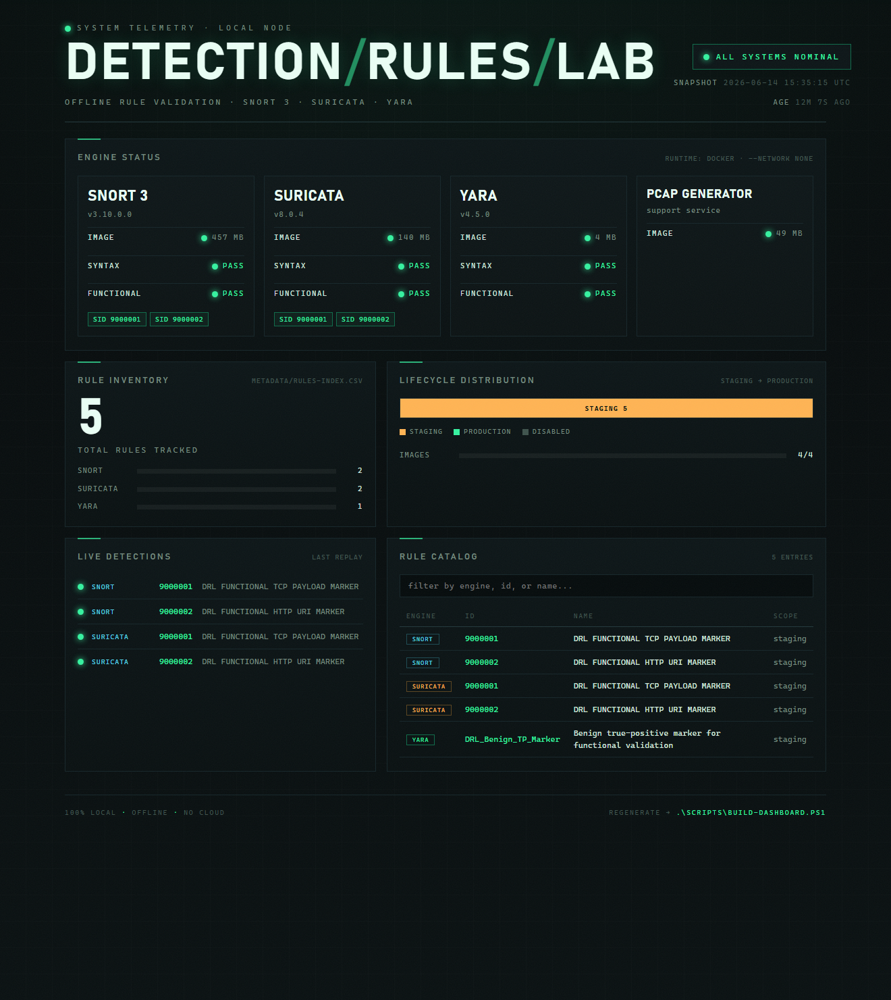

# detection-rules-lab

> A 100% local, offline workbench for **writing, validating, and functionally testing** network and host detection rules — **Snort 3**, **Suricata**, and **YARA** — with zero cloud dependencies.


-informational.svg)

`detection-rules-lab` is a version-controlled rule repository **plus** an automated
validation pipeline. Every check — syntax compilation and live functional testing —
runs inside pinned local Docker containers launched with `--network none`. Nothing
ever leaves the machine, which makes it suitable for air-gapped or privacy-constrained
environments.

- **Syntax validation** — each rule is loaded by its engine in test/dry-run mode.
- **Functional validation** — synthetic telemetry is generated offline and replayed
  to prove rules actually fire (and don't false-positive).
- **Fail-closed Git gate** — a pre-commit hook blocks broken rules from being committed.
- **Self-documenting** — a rule catalog (`metadata/rules-index.csv`) is regenerated
  automatically and kept in lockstep with the rules.



> The offline monitoring dashboard (`.\scripts\Build-Dashboard.ps1 -Open`) — engine
> health, rule inventory, lifecycle, live detections, and a filterable catalog.

---

## Table of contents
- [Why](#why)
- [Architecture](#architecture)
- [Requirements](#requirements)
- [Quick start](#quick-start)
- [Everyday usage](#everyday-usage)
- [Monitoring dashboard](#monitoring-dashboard)
- [Repository layout](#repository-layout)
- [How validation works](#how-validation-works)
- [Extending the framework](#extending-the-framework)
- [Privacy & offline guarantees](#privacy--offline-guarantees)
- [Roadmap](#roadmap)
- [Security](#security)
- [Contributing](#contributing)
- [License](#license)

---

## Why

Detection engineering needs a fast, repeatable feedback loop: *is this rule
syntactically valid, and does it actually detect what I think it does?* Many teams
answer that with cloud sandboxes or SaaS pipelines — a non-starter when rules,
samples, or captures are sensitive. `detection-rules-lab` gives you that loop entirely
on the local host: reproducible, containerized, and offline by construction.

## Architecture

```
                         ┌─────────────────────────────────────────────┐
   git commit  ────────► │  pre-commit hook → Invoke-Validation.ps1     │
                         └───────────────┬─────────────────────────────┘
                                         │ orchestrates
        ┌────────────────────────────────┼────────────────────────────────┐
        ▼                                ▼                                 ▼
  Validate-Syntax.ps1            Test-Functional.ps1               Update-RuleIndex.ps1
        │                                │                                 │
        │ docker run --rm --network none │ (offline)                       │ (no engine)
        ▼                                ▼                                 ▼
 ┌─────────────┐  ┌──────────────┐  ┌──────────┐  ┌────────────┐    metadata/
 │ drl/snort3  │  │ drl/suricata │  │ drl/yara │  │drl/pcapgen │    rules-index.csv
 │   (-T)      │  │    (-T)      │  │ (yarac)  │  │  (Scapy)   │
 └─────────────┘  └──────────────┘  └──────────┘  └────────────┘
        ▲ replay synthetic PCAP / scan benign samples ▲
```

The host runs Git and PowerShell. All engine execution is delegated to short-lived,
network-isolated containers, so the framework behaves identically on any machine that
can run the images.

## Requirements

| Component | Why | Notes |
|---|---|---|
| **Docker** (Linux engine) | runs the four validator images | Docker Desktop on Windows/macOS, or Docker Engine on Linux |
| **PowerShell 5.1+** | orchestration scripts | Ships with Windows. On Linux/macOS use **PowerShell 7 (`pwsh`)** |
| **Git** | versioning + the pre-commit gate | any recent version |

> The reference setup is Windows + PowerShell + Docker Desktop, but the scripts are
> plain PowerShell and the images are Linux — running the runner under `pwsh` on
> Linux/macOS requires no code changes. See [Extending the framework](#extending-the-framework).

## Quick start

```powershell
# 1. Clone
git clone <your-repository-url> detection-rules-lab
cd detection-rules-lab

# 2. Build the four local validator images (one-time; pulls base layers once).
#    Use -SkipSnort for a faster first run without the large Snort 3 image.
.\scripts\Build-Images.ps1

# 3. Activate the pre-commit gate (also runs `git init` if needed).
.\scripts\Install-GitHooks.ps1

# 4. Validate everything: syntax + functional, all engines.
.\scripts\Invoke-Validation.ps1 -Full
```

A non-technical, click-by-click version is in
[docs/WALKTHROUGH.md](docs/WALKTHROUGH.md), and `RUN-DEMO.bat` (repo root) runs the
whole proof on a double-click.

## Everyday usage

| Goal | Command |
|---|---|
| Full check (syntax + functional, all engines) | `.\scripts\Invoke-Validation.ps1 -Full` |
| Syntax only, all engines | `.\scripts\Invoke-Validation.ps1` |
| One engine, one stage | `.\scripts\Validate-Syntax.ps1 -Engine suricata -Scope staging` |
| Functional test one engine | `.\scripts\Test-Functional.ps1 -Engine snort` |
| Validate specific files | `.\scripts\Validate-Syntax.ps1 -Files rules/yara/staging/selftest.yar` |
| Rebuild the rule catalog | `.\scripts\Update-RuleIndex.ps1` |
| Build / refresh the monitoring dashboard | `.\scripts\Build-Dashboard.ps1 -Open` |

Then just `git add` / `git commit` — the pre-commit hook validates staged rules and
**blocks the commit on any error**.

## Repository layout

```
detection-rules-lab/
├─ rules/                         # the rule corpus, by engine + lifecycle
│  ├─ snort/    { staging, production, disabled }
│  ├─ suricata/ { staging, production, disabled }
│  └─ yara/     { staging, production, disabled }
├─ config/                        # engine configs used ONLY for validation
│  ├─ snort/snort.lua
│  └─ suricata/suricata.yaml
├─ docker/                        # pinned local validator images (Dockerfiles + compose)
├─ tests/
│  ├─ generators/gen_pcaps.py     # offline Scapy PCAP synthesis
│  ├─ pcaps/                      # generated PCAPs (gitignored, reproducible)
│  ├─ samples/yara/               # benign true-positive + negative-control files
│  ├─ fixtures/                   # intentionally-broken rule(s) for negative tests
│  └─ expected/expected.json      # telemetry → required detections map
├─ scripts/                       # the validation engine (PowerShell)
├─ dashboard/template.html        # monitoring UI source (index.html is generated)
├─ metadata/rules-index.csv       # auto-generated rule catalog
├─ .githooks/{pre-commit,pre-push}
├─ .github/                       # issue + PR templates
├─ SECURITY.md
└─ docs/ { VALIDATION, METADATA-SCHEMA, EDGE-CASES, WALKTHROUGH, BRANCH-PROTECTION }
```

**Lifecycle:** new rules land in `staging/`, are promoted with `git mv` to
`production/` only after functional tests pass, and retired rules move to `disabled/`.

## How validation works

| Engine | Syntax (test mode) | Functional |
|---|---|---|
| **Snort 3** | `snort -c snort.lua -R <file> -T` | replay PCAP with `-r`, parse `alert_fast.txt` |
| **Suricata** | `suricata -T -c suricata.yaml -S <file>` | replay PCAP with `-r`, parse `fast.log` / `eve.json` |
| **YARA** | `yarac <file>` (compile) | scan benign samples, assert match + no false positive |

Synthetic network traffic is built deterministically with Scapy (no capture needed),
and expectations live in [tests/expected/expected.json](tests/expected/expected.json).
The explicit per-engine `docker` commands behind the scripts are in
[docs/VALIDATION.md](docs/VALIDATION.md).

## Monitoring dashboard

Double-click **`VIEW-DASHBOARD.bat`** (builds the latest status and opens it in your
browser), or run:

```powershell
.\scripts\Build-Dashboard.ps1 -Open
```

This collects live status (image build state + size, engine version, syntax and
functional pass/fail, and the SIDs that fired in the last replay) into
`reports/status.json`, then bakes a **self-contained** `dashboard/index.html` —
data is inlined, so it opens on a double-click with **no server, no network, no
cloud**. The UI source is `dashboard/template.html`; the generated `index.html` is
git-ignored. Use `-NoValidate` to re-render instantly from the last snapshot.

## Extending the framework

The design is intentionally open-ended:

- **Add rules:** drop them in `rules/<engine>/staging/`, following
  [docs/METADATA-SCHEMA.md](docs/METADATA-SCHEMA.md). Validation picks them up
  automatically — no script changes.
- **Add functional coverage:** extend `tests/generators/gen_pcaps.py` (or add a new
  generator) and a YARA sample, then add an entry to `expected.json`.
- **Add a new engine** (e.g., Sigma, Zeek, ClamAV): add a `docker/<engine>/Dockerfile`,
  register the image in the `$Images` manifest in
  [scripts/lib/Common.ps1](scripts/lib/Common.ps1), and add a validator function in
  `Validate-Syntax.ps1` / `Test-Functional.ps1`. The orchestrator and hook need no
  changes.
- **Run on Linux/macOS:** install PowerShell 7 and invoke the same scripts with `pwsh`.
- **Promote to CI:** the scripts are exit-code driven, so they slot directly into any
  local CI runner (the `pre-push` hook already runs the full suite).

## Privacy & offline guarantees

- **No cloud / SaaS** is used for validation, ever.
- Every validation container runs **`--network none`** — network-isolated by design.
- The only external fetch is the **one-time Docker base-image pull** during
  `Build-Images.ps1`. For a true air gap, `docker save` / `docker load` the four
  `drl/*:local` images and skip the build entirely.
- Rules and configs are version-controlled; test PCAPs are **generated from code**, not
  committed as opaque binaries.

## Roadmap

Ideas that the architecture already accommodates:

- Additional engines (Sigma → backend conversion, Zeek, ClamAV).
- Performance/throughput profiling on large representative captures.
- Structured (`eve.json`) alert assertions and per-rule coverage reporting.
- A Linux/`pwsh` reference path and an optional containerized runner.

## Security

Report vulnerabilities **privately** — see [SECURITY.md](SECURITY.md) (do not open
public issues). The framework is designed to parse untrusted rule content safely:
all execution is sandboxed in `--network none` containers. Recommended `main`
branch protections are documented in
[docs/BRANCH-PROTECTION.md](docs/BRANCH-PROTECTION.md).

## Contributing

See [CONTRIBUTING.md](CONTRIBUTING.md) for the authoring → validation → promotion
workflow and the definition of done. Issue and pull-request templates live in
[.github/](.github/).

## License

Released under the [MIT License](LICENSE).

Built on these upstream open-source projects, used unmodified as base images:
[Snort 3](https://www.snort.org/) (Cisco Talos), [Suricata](https://suricata.io/)
(OISF), and [YARA](https://virustotal.github.io/yara/). Their respective trademarks
and licenses belong to their owners.
